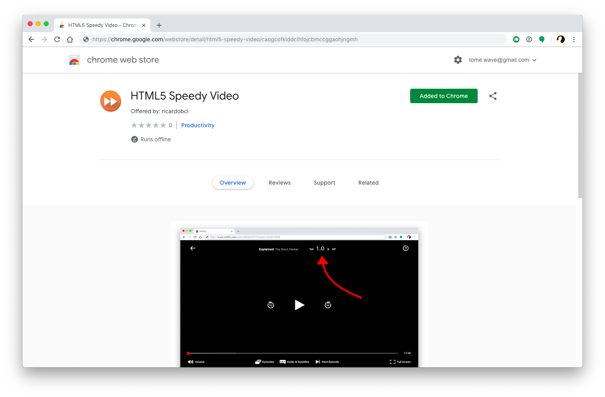
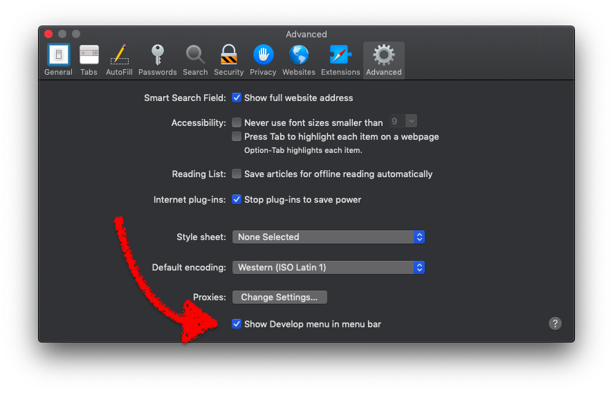

# HTML5 Speedy Video Extension (for Chrome and Safari)

A browser extension that is the easiest way to get more control over playback
speed of videos on Netflix, Youtube or websites that use VideoJS HTML5 player.
It also provides some easy shortcuts for video manipulation. Works on Chrome and
Safari (last tested on Chrome 69 and Safari 12), when the player is HTML5 and on
whitelisted websites.

### Netflix


### Youtube


### VideoJS


**NOTE**: Chrome is easier to install, but safari on a mac is _usually_ more CPU
efficient at video playback. That's why I included a safari version.

## Download & Installing

For Chrome, you can install the [extension in the Chrome Web Store](https://chrome.google.com/webstore/detail/html5-speedy-video/caogcofklddclhfojcbmccggaohjngmh):



If you want to install manually in your local machine, you can get the extension via direct download from the releases tab or build from source:

### Releases (easier)

Just download this project's ZIP for [Chrome](https://github.com/ricardobcl/HTML5-Speedy-Video-Extension/releases/download/v2.0/SpeedyChrome.zip) and/or [Safari](https://github.com/ricardobcl/HTML5-Speedy-Video-Extension/releases/download/v2.0/SpeedySafari.zip) and them unpack it.
You should have a new folder for each browser.

### From Source

Or, you can run this on the terminal:

```Shell
> git clone https://github.com/ricardobcl/HTML5-Speedy-Video-Extension.git
> cd HTML5-Speedy-Video-Extension
> make
```

Then, do the following, depending on the browser you want:

### Installing Locally For Chrome

Go to [chrome extensions page](chrome://extensions/) and enable `Developer Mode`
on the top right corner. Then click `Load unpacked` and select the
folder `HTML5 Speedy Video Chrome` that you obtained in the previous step.


#### Installing Locally For Safari

Enable developer options in safari:



Then, open the `Extension Builder` in the menu `Develop`, click on the `+` button and select `Add Extension...` to select the folder `HTML5 Speedy Video.safariextension` that you obtained in the previous step.

Finally, just click `Install` or `Run` in the top right corner to install the extension.

**NOTE:** Unfortunately, you have to re-enable (open the `Extension Builder` and click `Run` again) every time you restart the browser.


## Config

These are the variable that you can modify to fit your taste in `speedy.js`:

```Javascript
// the config object with default values
app.config = {
  default_delta: 0.2, // smallest increment or decrement of playback speed
  default_skip_small: 2, // number of seconds to (small) skip or rewind the video
  default_skip_big: 10, // number of seconds to (big) skip or rewind the video
  debug: false, // flag to disable or enable console log debug info
  max_tries_finding_video: 150, // max number of tries to finding the video
  faster_text: "&#9758;",
  slower_text: "&#9756;",
  playerbar_class_name: {
    youtube: "ytp-chrome-controls", // name class of youtube player bar
    videojs: "vjs-control-bar", // name class of VideoJS player bar
    netflix: "ellipsize-text" // name class of Netflix player bar
  }
}
```

## Keyboard Shortcuts

It also adds these simple keyboard shortcuts:

| Key                   | Action                 |
| --------------------- | ---------------------- |
| control + `+`         | Speed up by 0.2x       |
| control + `-`         | Slow down by 0.2x      |
| control + `0`         | Set speed to 1x        |
| control + `1`         | Set speed to 1x        |
| control + `2`         | Set speed to 2x        |
| control + `3`         | Set speed to 2.5x      |
| control + `4`         | Set speed to 3x        |
| shift + :arrow_left:  | \*\* Rewind 2 seconds  |
| shift + :arrow_right: | \*\* Skip 2 seconds    |
| shift + :arrow_down:  | \*\* Rewind 10 seconds |
| shift + :arrow_up:    | \*\* Skip 10 seconds   |

They are hard-coded, but it's really simple to modify if you want in
`speedy.js`.

\*\* Not on Netflix, although they do skip and rewind by default anyway, just
not these amounts.

## Website Whitelist

The extension only runs on explicitly allowed websites. By default it comes with some allowed websites (e.g., Youtube, Netflix), but you can change which pages this extension runs by changing `content_scripts` -> `matches` in `manifest.json` for _Chrome_ (see [google's content script docs](https://developer.chrome.com/extensions/content_scripts) for more information), or `Whitelist` in `Info.plist` for _Safari_ (see [permission documentation for safari](https://developer.apple.com/library/safari/documentation/Tools/Conceptual/SafariExtensionGuide/ExtensionPermissions/ExtensionPermissions.html) for more information).

## Disclaimer

This is intended to be a fun personal project, both to train Javascript and to be useful in my daily life (I love to speed-up videos).
This is not a commercial product and thus support is not available.

## License

[MIT license](http://opensource.org/licenses/MIT)
