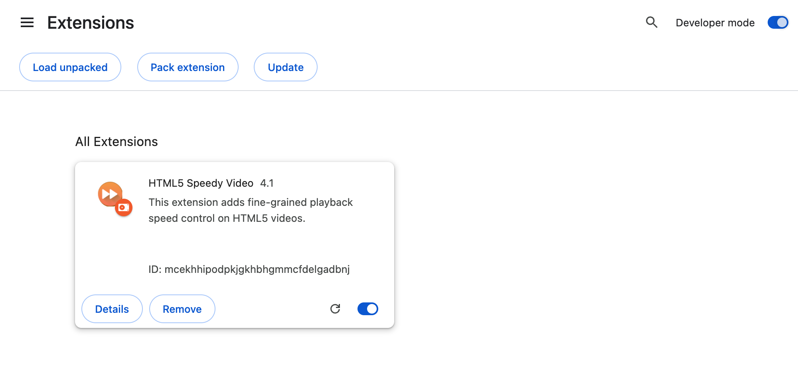

<h1 align="center">🎬 HTML5 Speedy Video Extension</h1>

<p align="center"><b>⚡ Freshly rebuilt in 2026 — version 4.2 ⚡</b><br>
Manifest V3 · Chrome &amp; Safari · one-command install</p>

<p align="center">
  
  
  
  <a href="https://github.com/ricardobcl/HTML5-Speedy-Video-Extension/actions/workflows/ci.yml"></a>
  
</p>

A tiny browser extension for fine-grained control over the playback speed of
HTML5 videos on Youtube (Shorts included), Netflix, Instagram, X, Patreon, WhatsApp and
other whitelisted websites: keyboard shortcuts, plus an overlay that shows the speed
whenever it changes — and that overlay is the only thing it adds to the page.

It is a small [Manifest V3](https://developer.chrome.com/docs/extensions/develop/migrate)
content-script extension: no background page, no network access and no
permissions beyond the whitelisted websites. Local installation only, for now.
Last tested on Youtube with Chrome 152 and Safari 26.6.

## 🆕 What's new in 4.x (2026)

The 2018 version stopped loading years ago: Manifest V2 is gone from Chrome
and the old extension format is gone from Safari. 4.0 is a rebuild:

- ✅ **Works again** — Manifest V3, tested on Chrome 152
- 🧭 **Safari support** — as a signed Safari Web Extension (`make safari`)
- ⌨️ **New shortcuts** — `w`/`q` for ±0.25x, `a`/`s`/`d` for 1x/2x/3x, `z` shows the speed
- 👀 **Speed overlay** — on the video whenever the speed changes, also in fullscreen
- 🌐 **More websites** — Youtube Shorts, Instagram (feed, reels and stories), X, Patreon, WhatsApp and Youtube embeds anywhere
- 🎯 **Follows the playing video** — feeds, reels, stories and Shorts just work
- 🧹 **Nothing else on the page** — the old ☜ 1x ☞ buttons on the player bar are gone
- 🐛 **Fixes** — no more runaway polling, leaked timers or speeds Chrome refuses
- 🚀 **One-command install** — `make install` for Chrome, `make safari` for Safari

### Youtube


### Youtube Shorts


## 🚀 Install in Chrome

**Without a terminal** — [download the ZIP of this repo](https://github.com/ricardobcl/HTML5-Speedy-Video-Extension/archive/refs/heads/master.zip)
and unzip it (the extension comes pre-built). Then:

1. Go to [chrome://extensions](chrome://extensions) and turn on **Developer mode** (top right corner)
2. Click **Load unpacked** and choose the `chrome` folder

Done — open a Youtube video.

**With git** (easier to update later):

```Shell
git clone https://github.com/ricardobcl/HTML5-Speedy-Video-Extension.git
cd HTML5-Speedy-Video-Extension
make install
```

`make install` builds the extension, highlights the folder in Finder and opens
`chrome://extensions` in Chrome for you — just turn on **Developer mode** and
click **Load unpacked** with the highlighted folder.



**Updating**: `git pull && make` (or re-download the ZIP), then click the
reload icon on the extension's card in `chrome://extensions`.

## 🧭 Install in Safari

Safari requires extensions to be wrapped in a Mac app (a
[Safari Web Extension](https://developer.apple.com/documentation/safariservices/safari-web-extensions)),
so you need [Xcode](https://apps.apple.com/app/xcode/id497799835) installed
(free, but big; the CLI tool [xcodes](https://github.com/XcodesOrg/xcodes)
can download it too). Then:

1. Add your Apple ID in Xcode → Settings → Accounts → **+** (a free account
   is enough; it shows up as your "Personal Team"). This lets `make safari`
   sign the extension, so Safari keeps it enabled across restarts.
2. Run:

   ```Shell
   make safari
   ```

   This converts the Chrome extension into a Safari Web Extension Xcode
   project (in the git-ignored `safari/` folder), signs and builds the small
   wrapper app and opens it, which registers the extension with Safari.
3. In Safari → Settings → Extensions, turn on **HTML5 Speedy Video**
4. Open a Youtube video, click the extension's icon in the toolbar and choose
   **Always Allow on Every Website** — Safari asks for permission per website
   even for the whitelisted ones, and the extension does nothing until you
   grant it (it still only runs on the whitelisted websites)

**NOTES**:

- **Updating**: run `make safari` again.
- `make safari` picks the first personal team of the Apple IDs in Xcode; use
  `make safari TEAM_ID=XXXXXXXXXX` to choose another one.
- Without an Apple ID in Xcode the app is ad-hoc signed and Safari only loads
  it while **Allow unsigned extensions** is on (Settings → Advanced → Show
  features for web developers, then Settings → Developer). That setting
  resets every time Safari quits, so signing is worth the one-time setup.
- Publishing the extension (App Store or notarized) would additionally
  require the paid Apple Developer Program.

## 🌐 Supported websites

By default the extension runs on:

| Website        | Notes                                                              |
| -------------- | ------------------------------------------------------------------ |
| Youtube        | regular videos and Shorts; covered by automated checks             |
| Netflix        | the seek shortcuts are left to Netflix's own                       |
| Instagram      | feed, reels and stories                                            |
| X              | `x.com` and `twitter.com`                                          |
| Patreon        | Patreon's own player and embedded Youtube videos                   |
| WhatsApp       | videos opened in the viewer of `web.whatsapp.com`                  |
| Youtube embeds | on any website (`youtube.com` and `youtube-nocookie.com` embeds): click the embedded player first, so it has focus |

It works on any HTML5 `<video>`, also inside shadow DOM: it controls the video
that is playing (the largest one, if several are), so it follows you through
feeds, reels, stories and Shorts, and keeps the speed you chose across videos
until you change it. Videos that show up later, e.g. opened in a viewer, are
picked up when they start playing. It also runs inside frames, which is how
embedded Youtube players work. To run it on another website, add it to the
whitelist (see [Website Whitelist](#-website-whitelist)).

## ⌨️ Keyboard Shortcuts

| Key                   | Action                              |
| --------------------- | ----------------------------------- |
| `w`                   | Speed up by 0.25x                   |
| `q`                   | Slow down by 0.25x                  |
| `a`                   | Set speed to 1x                     |
| `s`                   | Set speed to 2x                     |
| `d`                   | Set speed to 3x                     |
| `z`                   | Show the current speed on the video |
| shift + :arrow_left:  | \*\* Rewind 2 seconds               |
| shift + :arrow_right: | \*\* Skip 2 seconds                 |
| shift + :arrow_down:  | \*\* Rewind 10 seconds              |
| shift + :arrow_up:    | \*\* Skip 10 seconds                |

Whenever the speed changes the new speed is shown for a second in an overlay
near the top of the video, also in fullscreen. Press `z`
to show it at any time.

Notes:

- The speed is kept between `minSpeed` and `maxSpeed` (0.2x to 4x by default).
- Shortcuts are ignored while you are typing in a text field, so they don't
  interfere with searching or commenting, and modifier combos like
  control + `a` are never stolen.
- The letter keys are only taken while a video is on screen; with none (e.g.
  a chat with its video viewer closed) they reach the website as usual.
- They are all configurable in the `config` object of `src/speedy.js`
  (`fasterKey`, `slowerKey`, `overlayKey` and `speedPresets`).

\*\* Not on Netflix, although they do skip and rewind by default anyway, just
not these amounts.

## ⚙️ Config

These are the variables (the `config` object at the top of `src/speedy.js`)
that you can modify to fit your taste (run `make` or `make safari` again
afterwards):

```Javascript
const config = {
  speedDelta: 0.25, // smallest increment or decrement of playback speed
  minSpeed: 0.2, // lowest playback speed allowed
  maxSpeed: 4.0, // highest playback speed allowed
  speedPresets: { a: 1.0, s: 2.0, d: 3.0 }, // key -> playback speed
  skipSmall: 2, // seconds seeked by shift + left/right
  skipBig: 10, // seconds seeked by shift + up/down
  fasterKey: "w", // key that speeds up by speedDelta
  slowerKey: "q", // key that slows down by speedDelta
  overlayKey: "z", // key that shows the current speed on top of the video
  overlayDuration: 1000, // ms the speed overlay stays visible
  applyInterval: 1000, // ms between checks that the playing video has the chosen speed
  pollInterval: 250, // ms between attempts to find a video after a page change
  maxTriesVideo: 150, // max number of attempts to find a video
  debug: false // enables console.log debug info
}
```

## 🌐 Website Whitelist

The extension only runs on explicitly allowed websites. By default it comes
with Youtube, Netflix, Instagram, X, Patreon and WhatsApp, but you can change which
pages this extension runs by changing `content_scripts` -> `matches` in
`chrome/manifest.json` (see
[google's content script docs](https://developer.chrome.com/docs/extensions/develop/concepts/content-scripts)
for more information). After changing it, click the reload icon on the
extension's card in `chrome://extensions`, or run `make safari` again.

## 🛠️ Development

The source lives in `src/`; `make` copies it into the Chrome extension
folder, which is committed so that the ZIP download comes pre-built. The
Safari Xcode project is generated from the Chrome folder, so it always picks
up the latest build.

```Shell
> npm install   # once, installs ESLint
> npm run lint  # lints src/
> make          # builds the Chrome extension folder
> make install  # builds and walks you through loading it in Chrome
> make safari   # converts it into a Safari Xcode project (requires Xcode)
```

CI runs the lint on every push and fails if the committed build is out of
date with `src/` (fix with `make` + commit).

## 📝 Disclaimer

This is intended to be a fun personal project, both to train Javascript and to be useful in my daily life (I love to speed-up videos).
This is not a commercial product and thus support is not available.

## 📄 License

[MIT license](LICENSE)
